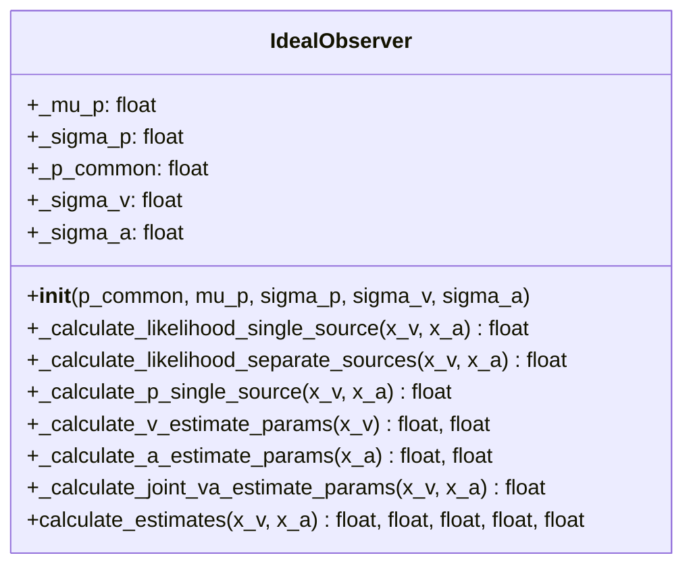

# Portfolio 2 -	Bayesian programming for perception

Code illustrating the "ventriloquist effect" using a generative model and
an ideal Bayesian observer model, inspired on Kording et al. (2007) and
also described in Ferreira & Dias (2014).

A generative model will be used to simulate experimental trial data, which models visual
and auditory stimuli corresponding to either one source or two independent sources (currently includes stub code instead, generating fixed experimental data for only 10 trials: to be edited by students).

An ideal Bayesian observer is then used to implement a model to estimate whether stimuli arise 
from a common cause (the "ventriloquist effect") and to estimate individual stimulus source locations
from the generated experimental data. Estimates and posterior distributions are plotted when number of trials is small (i.e. <=10). 

Finally, the ideal observer is evaluated for the simulated experiment w/ multiple trials, and metrics summarising its performance over all trials are plotted.

The UML class diagram for the ideal Bayesian observer class in question is shown below:

### Dependencies

This project requires that the following packages are installed:

- `numpy` for scientific maths.
- `scipy`/`scipy.stats` for statistics and probability distributions.
- `matplotlib` for plots (native).
- `seaborn` for advanced plotting wrapper.

### References

Kording, K.P., Beierholm, U., Ma, W.J., Quartz, S., Tenenbaum, J.B., Shams, 
L.: Causal Inference in Multisensory Perception. PLoS ONE 2(9), e943 (2007),
doi:10.1371/journal.pone.0000943

João Filipe Ferreira & Jorge Dias, Probabilistic Approaches for Robotic Perception,
Springer International Publishing, 2014, Chapter 4.
